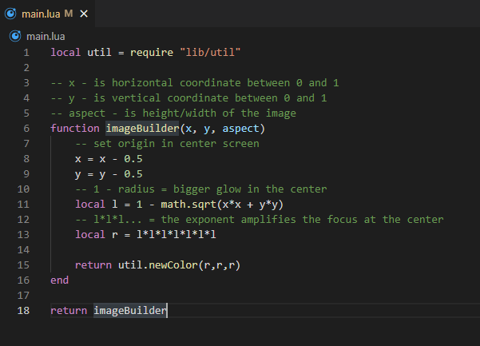

# Image Builder in Lua.
## Use mode:
- implements the function 'imageBuilder' in 'main.lua'
- execute build lua (example **lua build.lua** or **luajit build.lua**)
- define the name of output image
- define the image width
- define the image height
- define the name of the lua interpreter (example **lua** or **luajit**)

## Dependencies:
- Lua interpreter
- JRE (1.8)

### Image example

### Code example
